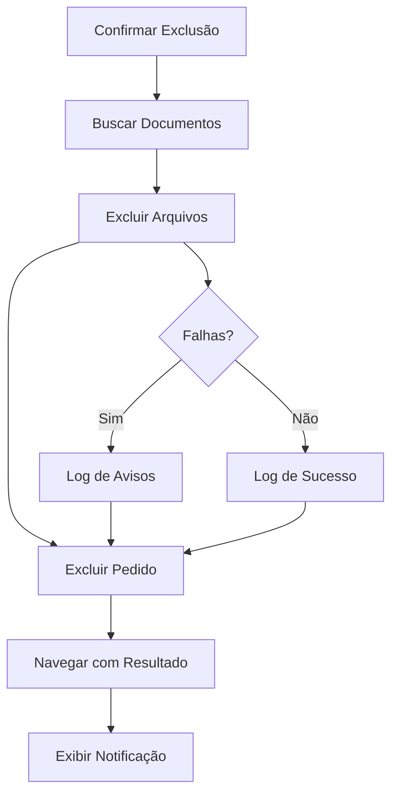

# Exclusão de Pedidos com Arquivos - Documentação

## 📋 Visão Geral

Esta funcionalidade implementa a exclusão automática de arquivos do bucket `article_documents` quando um pedido é excluído, seguindo o princípio de responsabilidade única e estrutura modular.

## 🏗️ Arquitetura

### Estrutura de Pastas

```
src/pages/Orders/
├── services/
│   └── OrderDeletionService.ts     # Serviço para exclusão de arquivos
├── hooks/
│   └── useOrderDeletionWithFiles.ts # Hook para gerenciar exclusão completa
├── components/
│   └── OrderDeletionNotification.tsx # Componente de notificação detalhada
├── actions/
│   └── useOrderInfoModal.ts         # Hook atualizado para usar novo serviço
└── index.ts                         # Exports centralizados
```

## 🔧 Componentes Principais

### 1. OrderDeletionService

**Responsabilidade**: Gerenciar a exclusão de arquivos do bucket `article_documents`

**Métodos principais**:
- `getOrderArticleDocuments(orderId)`: Busca documentos associados ao pedido
- `deleteArticleDocuments(items)`: Exclui lista de arquivos do bucket
- `deleteOrderArticleDocuments(orderId)`: Exclusão completa dos arquivos de um pedido

```typescript
// Exemplo de uso
const result = await OrderDeletionService.deleteOrderArticleDocuments(orderId);
console.log(`Arquivos excluídos: ${result.deletedFiles.length}`);
console.log(`Falhas: ${result.failedFiles.length}`);
```

### 2. useOrderDeletionWithFiles

**Responsabilidade**: Hook para coordenar exclusão de pedido + arquivos

**Características**:
- Executa exclusão de arquivos ANTES de excluir o pedido
- Gerencia estado de loading e erros
- Navega automaticamente após conclusão
- Fornece feedback detalhado

```typescript
// Exemplo de uso
const { deleteOrderWithFiles, isDeleting, error } = useOrderDeletionWithFiles();

const handleDelete = async (orderId: string) => {
  const result = await deleteOrderWithFiles(orderId);
  if (result.success) {
    console.log("Exclusão completa realizada!");
  }
};
```

### 3. OrderDeletionNotification

**Responsabilidade**: Exibir resultado detalhado da exclusão

**Características**:
- Mostra arquivos excluídos com sucesso
- Lista falhas com mensagens de erro
- Design responsivo com tema claro/escuro
- Auto-dismiss opcional

```tsx
// Exemplo de uso
<OrderDeletionNotification
  isVisible={showNotification}
  result={deletionResult}
  onClose={() => setShowNotification(false)}
/>
```

## 🔄 Fluxo de Execução

### Exclusão de Pedido com Arquivos

1. **Usuário confirma exclusão** → `useOrderInfoModal.deleteOrder()`
2. **Buscar arquivos** → `OrderDeletionService.getOrderArticleDocuments()`
3. **Excluir arquivos** → `OrderDeletionService.deleteArticleDocuments()`
4. **Excluir pedido** → `deleteCompleteOrder()` (original)
5. **Navegar com resultado** → `navigateAfterDeletion()`
6. **Exibir toast** → Sistema de notificação existente



## ⚙️ Configuração e Uso

### Integração Existente

A funcionalidade foi integrada ao sistema existente através do hook `useOrderInfoModal`, mantendo compatibilidade total:

```typescript
// Antes (funcionamento original mantido)
const { deleteOrder, isDeleting } = useOrderInfoModal();

// Agora (com exclusão de arquivos automática)
const { deleteOrder, isDeleting } = useOrderInfoModal(); // Mesma interface!
```

### Personalização de Mensagens

O sistema suporta diferentes tipos de resultado:

```typescript
// Sucesso completo
navigate("/orders", {
  state: {
    deletionSuccess: true,
    message: "Pedido e arquivos associados excluídos com sucesso!"
  }
});

// Sucesso parcial (pedido excluído, alguns arquivos falharam)
navigate("/orders", {
  state: {
    deletionSuccess: true,
    message: `Pedido excluído com sucesso! Atenção: ${failedCount} arquivo(s) não puderam ser removidos.`
  }
});

// Falha completa
navigate("/orders", {
  state: {
    deletionSuccess: false,
    message: "Erro ao excluir pedido. Tente novamente."
  }
});
```

## 🔒 Segurança e Permissões

### Políticas RLS

A exclusão de arquivos respeita as políticas RLS (Row Level Security) configuradas:

- Usuários só podem excluir arquivos próprios
- Verificação de ownership através de `auth.uid()`
- Logs de segurança para tentativas não autorizadas

### Tratamento de Erros

```typescript
// Tipos de erro tratados
- "permission": Sem permissão para excluir
- "not found": Arquivo não encontrado
- "42501": Políticas de DELETE ausentes
- Outros: Erros genéricos do storage
```

## 📊 Monitoramento e Logs

### Logs Estruturados

O sistema produz logs detalhados para debug e monitoramento:

```typescript
console.log("🔍 Buscando documentos de artigos para o pedido:", orderId);
console.log("🗑️ Excluindo arquivo:", filePath);
console.log("✅ Arquivo excluído com sucesso:", filePath);
console.log("❌ Erro ao excluir arquivo:", error);
console.log("📊 Resumo da exclusão:", { sucessos, falhas });
```

### Métricas Disponíveis

- Número de arquivos excluídos com sucesso
- Número de falhas na exclusão
- Tempo de execução da operação
- Tipos de erro mais comuns

## 🧪 Testes e Validação

### Cenários de Teste

1. **Pedido sem arquivos**: Deve excluir apenas o pedido
2. **Pedido com 1 arquivo**: Deve excluir arquivo + pedido
3. **Pedido com múltiplos arquivos**: Deve excluir todos os arquivos + pedido
4. **Arquivo não encontrado**: Deve continuar e excluir o pedido
5. **Sem permissão no arquivo**: Deve continuar e excluir o pedido
6. **Falha na exclusão do pedido**: Deve manter os arquivos

### Validação Manual

```typescript
// Verificar se arquivos foram realmente excluídos
const { data } = await supabase.storage
  .from('article_documents')
  .list('pasta-do-usuario');

// Verificar se pedido foi excluído
const { data: order } = await supabase
  .from('orders')
  .select('id')
  .eq('id', orderId)
  .single();
```

## 🚀 Extensões Futuras

### Funcionalidades Planejadas

1. **Backup antes da exclusão**: Mover arquivos para pasta de backup
2. **Exclusão em lote**: Excluir múltiplos pedidos com arquivos
3. **Recuperação de arquivos**: Restaurar arquivos excluídos acidentalmente
4. **Compactação**: Comprimir arquivos antes da exclusão
5. **Auditoria**: Log detalhado de todas as exclusões

### Hooks Adicionais

```typescript
// Futuras extensões
useOrderBatchDeletion()     // Exclusão em lote
useOrderArchival()          // Arquivamento em vez de exclusão
useOrderRecovery()          // Recuperação de pedidos excluídos
```

## 📋 Checklist de Implementação

- [x] Criar `OrderDeletionService`
- [x] Implementar `useOrderDeletionWithFiles`
- [x] Atualizar `useOrderInfoModal`
- [x] Criar componente de notificação
- [x] Estruturar exports centralizados
- [x] Documentar funcionalidade
- [ ] Implementar testes unitários
- [ ] Adicionar métricas de performance
- [ ] Configurar monitoramento de erros

## 🤝 Contribuição

Para contribuir com melhorias:

1. Manter princípio de responsabilidade única
2. Adicionar testes para novos cenários
3. Documentar mudanças na API
4. Seguir padrões de logging existentes
5. Validar compatibilidade com sistema existente
