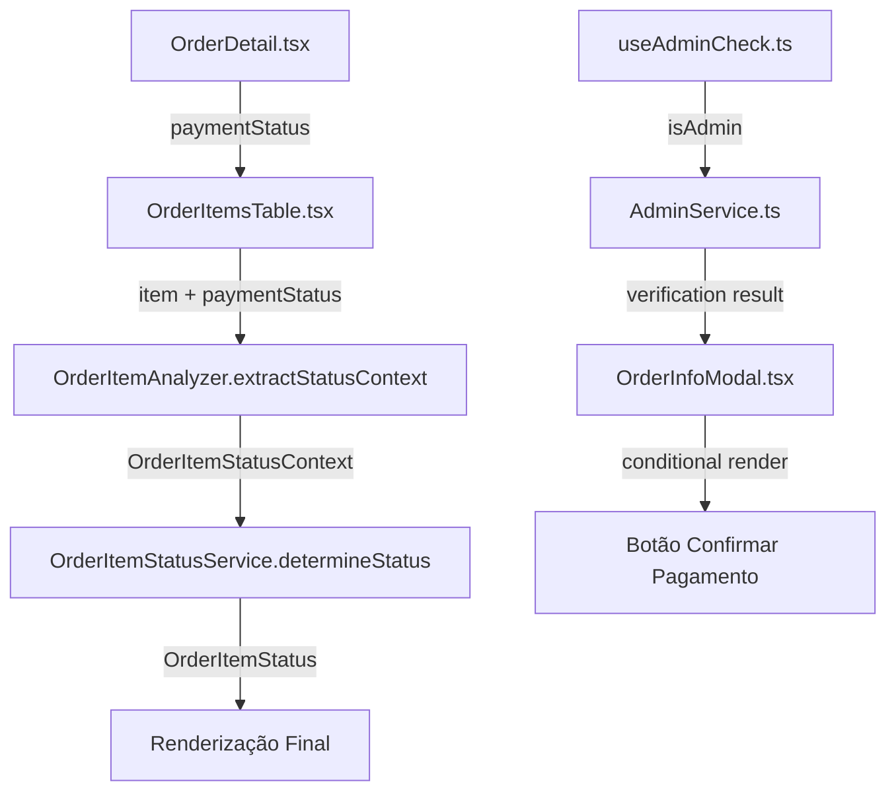

# 💰 Sistema de Status de Pagamento - Documentação Técnica

## 📋 Visão Geral

Este documento descreve as funcionalidades implementadas para exibição de status de pagamento pendente em diferentes componentes do sistema de pedidos. As alterações foram implementadas seguindo os princípios SOLID e incluem verificação de admin, exibição condicional de conteúdo e logs de debug estruturados.

## 🎯 Funcionalidades Implementadas

### 1. **Status "Pagamento Pendente" na Lista de Pedidos**
- **Arquivo**: `src/pages/Orders/OrderList.tsx`
- **Funcionalidade**: Exibe "Pagamento Pendente" em vermelho na coluna Status quando `payment_status === "pending"`
- **Prioridade**: Sobrescreve qualquer outro status quando pagamento está pendente

### 2. **Status "Pagamento Pendente" na Tabela de Itens**
- **Arquivos**: `src/pages/Orders/local-components/OrderItemsTable/`
- **Funcionalidade**: Sistema completo de status hierárquico para itens individuais
- **Prioridade Máxima**: Pagamento pendente sobrescreve todos os outros status

### 3. **Texto "Aguardando Pagamento" em Colunas Específicas**
- **Arquivo**: `src/pages/Orders/local-components/OrderItemsTable.tsx`
- **Funcionalidade**: Substitui conteúdo das colunas "Artigo DOC" e "URL do Artigo" quando pagamento pendente
- **Condição**: `paymentStatus === "pending"`

### 4. **Botão de Confirmar Pagamento para Admins**
- **Arquivo**: `src/pages/Orders/local-components/OrderInfoModal.tsx`
- **Funcionalidade**: Exibe botão para confirmar pagamento quando admin + pagamento pendente
- **Suporte**: Todos os métodos de pagamento (PIX, boleto, cartão)

### 5. **Sistema de Verificação de Admin com SOLID**
- **Arquivo**: `src/services/AdminService.ts`
- **Funcionalidade**: Arquitetura centralizada para verificação de permissões admin
- **Princípios**: Single Responsibility, Dependency Inversion

## 🏗️ Arquitetura Técnica

### Estrutura de Arquivos Modificados

```
src/pages/Orders/
├── OrderList.tsx                     # Lista de pedidos (status vermelho)
├── OrderListAdmin.tsx               # Lista admin (status vermelho)
├── OrderDetail.tsx                  # Detalhe do pedido (passa paymentStatus)
├── local-components/
│   ├── OrderItemsTable.tsx          # Tabela de itens (aguardando pagamento)
│   ├── OrderInfoModal.tsx           # Modal com botão confirmar pagamento
│   └── OrderItemsTable/
│       ├── types/
│       │   └── status.ts            # Tipos de status + payment_pending
│       ├── services/
│       │   └── OrderItemStatusService.ts  # Lógica de status hierárquico
│       └── utils/
│           └── OrderItemAnalyzer.ts # Extração de contexto + paymentStatus
├── hooks/
│   └── useAdminCheck.ts            # Hook de verificação admin refatorado
└── README_PAYMENT_STATUS_FEATURES.md  # Esta documentação

src/services/
└── AdminService.ts                 # Novo serviço SOLID para admin
```

### Fluxo de Dados



## 🔧 Implementação Detalhada

### 1. Sistema de Status Hierárquico

**Arquivo**: `OrderItemStatusService.ts`

```typescript
// Hierarquia de prioridade (maior para menor):
static determineStatus(context: OrderItemStatusContext): OrderItemStatus {
  // 0. PRIORIDADE MÁXIMA: Pagamento pendente
  if (context.paymentStatus === "pending") {
    return this.STATUS_CONFIG.payment_pending;
  }
  
  // 1. Status críticos (rejeitado)
  if (context.isRejected) {
    return this.STATUS_CONFIG.rejected;
  }
  
  // 2. Artigo publicado
  if (context.hasArticleUrl) {
    return this.STATUS_CONFIG.published;
  }
  
  // 3. Artigo enviado (aguardando publicação)
  if (context.hasArticle) {
    return this.STATUS_CONFIG.publication_pending;
  }
  
  // 4. Fluxo com pacote
  if (context.hasPackage) {
    if (context.hasOutline) {
      return this.STATUS_CONFIG.in_preparation;
    }
    return this.STATUS_CONFIG.pauta_pending;
  }
  
  // 5. Sem pacote (aguarda artigo)
  return this.STATUS_CONFIG.article_pending;
}
```

### 2. Configuração de Status

**Arquivo**: `OrderItemStatusService.ts`

```typescript
private static readonly STATUS_CONFIG = {
  payment_pending: {
    type: 'payment_pending',
    label: 'Pagamento Pendente',
    className: 'bg-red-50 text-red-600 dark:bg-red-500/15 dark:text-red-400'
  },
  // ... outros status
};
```

### 3. Extração de Contexto

**Arquivo**: `OrderItemAnalyzer.ts`

```typescript
static extractStatusContext(item: OrderItem, paymentStatus?: string): OrderItemStatusContext {
  return {
    hasPackage: this.hasPackageSelected(item),
    hasOutline: this.hasOutlineData(item),
    hasArticle: this.hasArticleData(item),
    hasArticleUrl: this.hasArticleUrl(item),
    publicationStatus: item.publication_status || '',
    isRejected: this.isRejected(item),
    isPublished: this.isPublished(item),
    paymentStatus: paymentStatus  // ← Novo campo
  };
}
```

### 4. Renderização Condicional

**Arquivo**: `OrderItemsTable.tsx`

```typescript
// Coluna "Artigo DOC"
{paymentStatus === "pending" ? (
  <span className="text-blue-600 dark:text-blue-400 italic">
    Aguardando Pagamento
  </span>
) : (
  // Lógica normal...
)}

// Coluna "URL do Artigo"  
{paymentStatus === "pending" ? (
  <span className="text-blue-600 dark:text-blue-400 italic">
    Aguardando Pagamento
  </span>
) : (
  // Lógica normal...
)}

// Coluna "STATUS"
{(() => {
  const context = OrderItemAnalyzer.extractStatusContext(item, paymentStatus);
  const status = OrderItemStatusService.determineStatus(context);
  return <span className={status.className}>{status.label}</span>;
})()}
```

### 5. Verificação de Admin (SOLID)

**Arquivo**: `AdminService.ts`

```typescript
export class AdminService {
  /**
   * Verifica se um usuário específico é admin
   */
  static async isUserAdmin(userId: string): Promise<boolean> {
    // Implementação com queries ao banco
  }

  /**
   * Verifica se o usuário atual é admin
   */
  static async isCurrentUserAdmin(): Promise<{ isAdmin: boolean; userId: string | null }> {
    // Implementação com auth + verificação
  }

  // Métodos privados para separação de responsabilidades
  private static async checkUserInRolesTable(userId: string): Promise<boolean>
  private static async checkUserInAdminsTable(userId: string): Promise<boolean>
}
```

## 🧪 Casos de Teste Essenciais

### Cenários de Status Prioritário

```typescript
describe('OrderItemStatusService', () => {
  test('PRIORIDADE 1: Payment pending sobrescreve todos os outros status', () => {
    const context = {
      paymentStatus: "pending",
      hasArticleUrl: true,    // Normalmente seria "published"
      isRejected: true,       // Normalmente seria "rejected"
      hasArticle: true,       // Normalmente seria "publication_pending"
      hasPackage: true,
      hasOutline: true,       // Normalmente seria "in_preparation"
    };
    
    const result = OrderItemStatusService.determineStatus(context);
    expect(result.type).toBe('payment_pending');
    expect(result.label).toBe('Pagamento Pendente');
  });

  test('PRIORIDADE 2: Rejected quando payment não pendente', () => {
    const context = {
      paymentStatus: "paid",  // ← Não pendente
      isRejected: true,
      hasArticleUrl: true,
    };
    
    const result = OrderItemStatusService.determineStatus(context);
    expect(result.type).toBe('rejected');
  });

  test('PRIORIDADE 3: Published quando tudo normal', () => {
    const context = {
      paymentStatus: "paid",
      isRejected: false,
      hasArticleUrl: true,
    };
    
    const result = OrderItemStatusService.determineStatus(context);
    expect(result.type).toBe('published');
  });
});
```

### Casos de Teste para Renderização Condicional

```typescript
describe('OrderItemsTable Conditional Rendering', () => {
  test('Deve exibir "Aguardando Pagamento" quando payment_status = pending', () => {
    const props = {
      paymentStatus: "pending",
      orderItems: [mockItem],
    };

    render(<OrderItemsTable {...props} />);
    
    // Verificar coluna "Artigo DOC"
    expect(screen.getByText('Aguardando Pagamento')).toBeInTheDocument();
    
    // Verificar coluna "URL do Artigo"
    expect(screen.getAllByText('Aguardando Pagamento')).toHaveLength(2);
    
    // Verificar coluna "STATUS"
    expect(screen.getByText('Pagamento Pendente')).toBeInTheDocument();
  });

  test('Deve exibir conteúdo normal quando payment_status = paid', () => {
    const props = {
      paymentStatus: "paid",
      orderItems: [mockItemWithArticle],
    };

    render(<OrderItemsTable {...props} />);
    
    // Não deve exibir "Aguardando Pagamento"
    expect(screen.queryByText('Aguardando Pagamento')).not.toBeInTheDocument();
    
    // Deve exibir conteúdo normal
    expect(screen.getByText('Enviar Artigo')).toBeInTheDocument();
  });
});
```

### Casos de Teste para Admin

```typescript
describe('AdminService', () => {
  test('Deve retornar true para usuário em roles admin', async () => {
    // Mock do supabase
    mockSupabase.from('roles').select.mockResolvedValue({
      data: [{ role: 'admin' }],
      error: null
    });

    const result = await AdminService.isUserAdmin('user-123');
    expect(result).toBe(true);
  });

  test('Deve retornar false para usuário sem permissões', async () => {
    mockSupabase.from('roles').select.mockResolvedValue({
      data: [],
      error: null
    });
    
    mockSupabase.from('admins').select.mockResolvedValue({
      data: [],
      error: null
    });

    const result = await AdminService.isUserAdmin('user-456');
    expect(result).toBe(false);
  });
});
```

### Casos de Teste para Modal

```typescript
describe('OrderInfoModal Admin Features', () => {
  test('Deve exibir botão confirmar pagamento para admin + payment pending', () => {
    const props = {
      order: { payment_status: 'pending', payment_method: 'pix' },
      isAdmin: true,
    };

    render(<OrderInfoModal {...props} />);
    
    expect(screen.getByText('Confirmar Pagamento')).toBeInTheDocument();
    expect(screen.getByText(/Pagamento via PIX aguardando confirmação/)).toBeInTheDocument();
  });

  test('Não deve exibir botão para usuário não-admin', () => {
    const props = {
      order: { payment_status: 'pending', payment_method: 'pix' },
      isAdmin: false,
    };

    render(<OrderInfoModal {...props} />);
    
    expect(screen.queryByText('Confirmar Pagamento')).not.toBeInTheDocument();
  });

  test('Não deve exibir botão quando pagamento não pendente', () => {
    const props = {
      order: { payment_status: 'paid', payment_method: 'pix' },
      isAdmin: true,
    };

    render(<OrderInfoModal {...props} />);
    
    expect(screen.queryByText('Confirmar Pagamento')).not.toBeInTheDocument();
  });
});
```

## 📊 Dados de Teste Mock

### Mock para OrderItem

```typescript
export const mockOrderItem = {
  id: 'item-123',
  product_name: 'Site de Teste',
  service_content: [JSON.stringify({
    title: "Pacote Premium",
    benefits: ["SEO", "Backlinks"]
  })],
  outline: null,
  article_document_path: null,
  article_doc: null,
  article_url: null,
  publication_status: 'pending'
};

export const mockOrderItemWithPaymentPending = {
  ...mockOrderItem,
  // paymentStatus será passado via prop para o contexto
};

export const mockOrderItemPublished = {
  ...mockOrderItem,
  article_url: 'https://example.com/article',
  publication_status: 'approved'
};
```

### Mock para Order

```typescript
export const mockOrder = {
  id: 'order-123',
  payment_status: 'pending',
  payment_method: 'pix',
  status: 'pending',
  total_amount: 299.99,
  billing_name: 'João Silva',
  billing_email: 'joao@email.com',
  created_at: '2025-08-14T10:00:00Z'
};

export const mockPaidOrder = {
  ...mockOrder,
  payment_status: 'paid',
  status: 'approved'
};
```

### Mock para Contexto Admin

```typescript
export const mockAdminContext = {
  isAdmin: true,
  userId: 'admin-123',
  loading: false,
  error: null
};

export const mockUserContext = {
  isAdmin: false,
  userId: 'user-456',
  loading: false,
  error: null
};
```

## 🔍 Logs de Debug

O sistema inclui logs estruturados para facilitar debugging:

```typescript
// AdminService
console.log('🔍 [AdminService] Verificando usuário admin:', { userId, isInRoles, isInAdmins });

// OrderItemStatusService  
console.log('🔍 [OrderItemStatusService] Determinando status:', { 
  paymentStatus, hasPackage, hasArticle 
});

// OrderInfoModal
console.log('🔍 [OrderInfoModal] Verificando botão confirmar pagamento:', {
  payment_method, payment_status, isAdmin, shouldShowButton
});
```

## 🚀 Execução de Testes

```bash
# Testes unitários
npm test -- --testPathPattern=OrderItemStatusService
npm test -- --testPathPattern=AdminService
npm test -- --testPathPattern=OrderItemsTable

# Testes de integração
npm test -- --testPathPattern=OrderInfoModal
npm test -- --testPathPattern=OrderList

# Testes end-to-end
npm run cypress:run --spec="cypress/e2e/payment-status.cy.ts"
```

## 📈 Métricas de Sucesso

- ✅ Status "Pagamento Pendente" aparece em vermelho quando `payment_status === "pending"`
- ✅ Texto "Aguardando Pagamento" substitui conteúdo das colunas quando payment pendente
- ✅ Botão "Confirmar Pagamento" aparece apenas para admin + payment pendente
- ✅ Sistema funciona para todos os métodos de pagamento (PIX, boleto, cartão)
- ✅ Logs estruturados facilitam debugging em produção
- ✅ Arquitetura SOLID permite fácil extensão e manutenção

## 🔮 Extensões Futuras

1. **Notificações Push**: Alertar admins sobre pagamentos pendentes
2. **Dashboard Analytics**: Métricas de pagamentos pendentes por período
3. **Auto-confirmação**: Integração com webhooks dos gateways de pagamento
4. **Histórico de Status**: Log de mudanças de status para auditoria
5. **Testes A/B**: Diferentes designs para status pendente

---

**Mantido por**: Equipe de Desenvolvimento  
**Última atualização**: Agosto 2025  
**Versão**: 1.0.0
