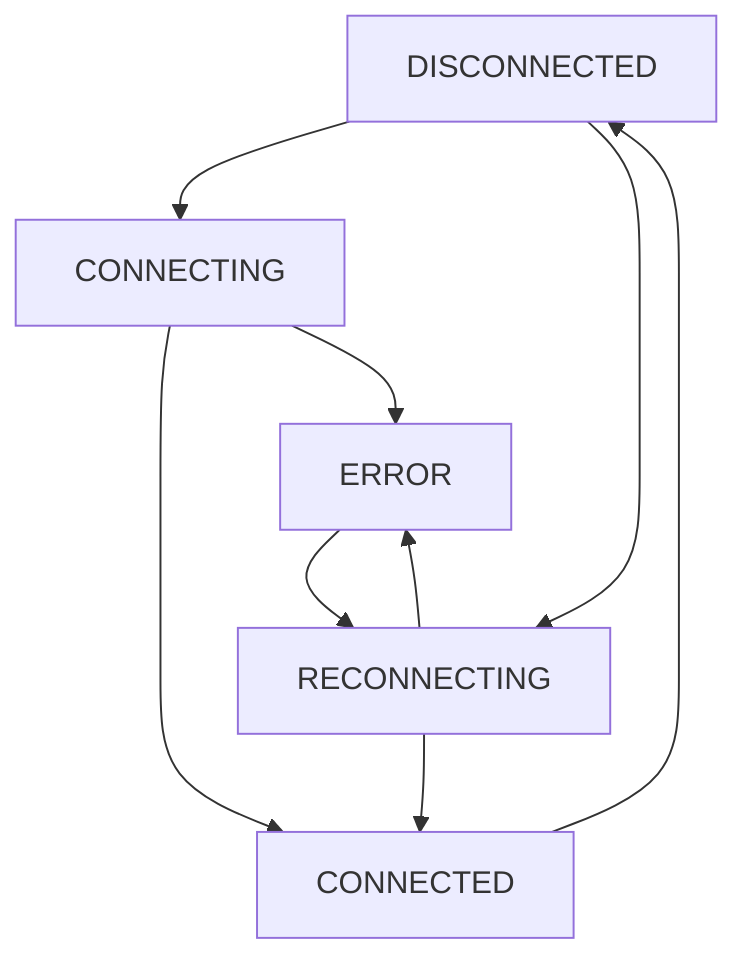

# Sistema de Gerenciamento de Conexão WebSocket

## Problema Resolvido

**Issue**: "Conexão perdida. Tentando reconectar..." aparecia de forma consistente e inadequada no chat modal.

**Causa Raiz**: 
- Lógica de gerenciamento de erro dispersa e duplicada
- Condições inconsistentes para exibição de erros
- Falta de controle adequado sobre estados de transição
- Violação dos princípios SOLID com responsabilidades misturadas

## Solução Implementada

### Arquitetura Modular (Princípios SOLID)

```
src/pages/Orders/local-components/ChatModal/
├── services/
│   └── connection/
│       ├── types.ts                     # Interfaces e tipos
│       ├── ConnectionStateManager.ts    # Gerenciador de estado
│       └── index.ts                     # Exports
├── hooks/
│   └── connection/
│       ├── useWebSocketConnection.ts    # Hook de conexão
│       └── index.ts                     # Exports
└── hooks/websocket/
    └── useChatWebSocket.ts             # Hook principal (refatorado)
```

### 1. ConnectionStateManager (SRP)

**Responsabilidade Única**: Gerenciar estados e transições de conexão WebSocket

```typescript
class ConnectionStateManager {
  // Estados: DISCONNECTED | CONNECTING | CONNECTED | RECONNECTING | ERROR
  // Determina quando mostrar erros baseado em contexto
  // Gerencia timeout e thresholds
  // Controla contador de tentativas
}
```

**Principais Funcionalidades**:
- ✅ **Estado Centralizado**: Um único local para gerenciar status de conexão
- ✅ **Threshold de Erro**: Só mostra erro após 2 segundos para evitar flashes
- ✅ **Contador de Tentativas**: Limita tentativas de reconexão (5 máximo)
- ✅ **Context Awareness**: Considera se modal está aberto antes de mostrar erro
- ✅ **Cleanup Automático**: Reset quando modal fecha

### 2. useWebSocketConnection Hook (SRP)

**Responsabilidade Única**: Interface React para gerenciamento de conexão

```typescript
const {
  connectionState,
  connectionError,
  setConnected,
  setConnecting,
  setReconnecting,
  setConnectionError
} = useWebSocketConnection({
  isModalOpen,
  onConnectionChange,
  onError
});
```

**Benefícios**:
- ✅ **Reatividade**: Atualiza automaticamente baseado em mudanças de estado
- ✅ **Callbacks**: Notifica componentes sobre mudanças
- ✅ **Lifecycle Management**: Reset automático quando modal fecha
- ✅ **Error Handling**: Lógica consistente de exibição de erros

### 3. useChatWebSocket Refatorado (DRY + SRP)

**Antes** (Problemático):
```typescript
// Lógica duplicada de erro
if (!connected && isOpen && error !== 'Falha na conexão...') {
  setError('Conexão perdida. Tentando reconectar...');
} else if (connected) {
  setError(null);
}

// Estados inconsistentes
const [error, setError] = useState<string | null>(null);
const isConnectedRef = useRef(false);
```

**Depois** (SOLID + DRY):
```typescript
// Delegação para ConnectionStateManager
const { connectionError, setConnected, setConnectionError } = useWebSocketConnection({
  isModalOpen: isOpen,
  onConnectionChange: (isConnected) => {
    // Atualiza apenas estado de UI
    setChatState(prev => ({ ...prev, isConnected }));
  }
});

// Uso simplificado
return { error: connectionError }; // Erro gerenciado centralmente
```

## Estados de Conexão

| Estado | Descrição | UI Behavior | Error Message |
|--------|-----------|-------------|---------------|
| **DISCONNECTED** | Inicial ou após perda | Pode mostrar erro após threshold | "Conexão perdida. Tentando reconectar..." |
| **CONNECTING** | Tentativa inicial | Loading, sem erro | Nenhum |
| **CONNECTED** | Conectado com sucesso | Normal, sem erro | Nenhum |
| **RECONNECTING** | Tentando reconectar | Loading | "Reconectando..." |
| **ERROR** | Falha após max tentativas | Erro persistente | "Falha na conexão. Funcionalidade limitada." |

## Fluxo de Estados



## Configurações

```typescript
const connectionManager = new ConnectionStateManager({
  maxReconnectAttempts: 5,        // Máximo de tentativas
  reconnectDelayMs: 3000,         // Delay entre tentativas
  showErrorThresholdMs: 2000      // Threshold para mostrar erro
});
```

## Benefícios da Solução

### ✅ Princípios SOLID Respeitados

1. **Single Responsibility**: Cada classe/hook tem uma responsabilidade específica
2. **Open/Closed**: Extensível via configurações sem modificar código base
3. **Liskov Substitution**: Interfaces consistentes e intercambiáveis
4. **Interface Segregation**: Interfaces específicas para cada necessidade
5. **Dependency Inversion**: Dependência de abstrações, não implementações

### ✅ Princípio DRY Aplicado

- **Lógica Centralizada**: Um único local para determinar quando mostrar erros
- **Reutilização**: ConnectionStateManager pode ser usado em outros contextos
- **Configuração Única**: Thresholds e limites definidos em um local

### ✅ Melhorias na UX

- **Sem Flash de Erro**: Threshold de 2s previne erro instantâneo
- **Mensagens Contextuais**: Diferentes mensagens para diferentes situações
- **Estado Consistente**: Transições previsíveis e controláveis
- **Cleanup Automático**: Reset quando modal fecha

### ✅ Maintainability

- **Código Modular**: Fácil de testar e modificar
- **Logs Estruturados**: Debug facilitado com contexto claro
- **TypeScript**: Tipagem forte previne erros

## Uso Prático

```typescript
// No componente ChatModal
const { error } = useChatWebSocket({ orderItemId, isOpen });

// Error é automaticamente:
// - null quando modal fechado
// - null durante conexão inicial (threshold)
// - "Conexão perdida..." após perda de conexão
// - "Reconectando..." durante tentativas
// - "Falha na conexão..." após esgotar tentativas
```

## Testabilidade

Cada módulo pode ser testado independentemente:

```typescript
// Teste do ConnectionStateManager
const manager = new ConnectionStateManager();
manager.setStatus('DISCONNECTED');
expect(manager.shouldShowError(true)).toBeNull(); // Dentro do threshold

// Teste do Hook
const { result } = renderHook(() => useWebSocketConnection({ isModalOpen: true }));
act(() => result.current.setConnected(false));
expect(result.current.connectionError).toBe('Conexão perdida...');
```

## Migração Realizada

**Arquivos Modificados**:
- ✅ `useChatWebSocket.ts` - Refatorado para usar novo sistema
- ✅ `ConnectionStateManager.ts` - Criado para gerenciar estados
- ✅ `useWebSocketConnection.ts` - Criado como interface React

**Comportamento Preservado**:
- ✅ Todas as funcionalidades existentes mantidas
- ✅ API pública do hook inalterada
- ✅ Compatibilidade com componentes existentes

**Melhorias Obtidas**:
- ✅ Erro "Conexão perdida" só aparece quando apropriado
- ✅ Estados de conexão consistentes e previsíveis
- ✅ Código mais limpo e maintível
- ✅ Fácil extensão para novos tipos de erro/estado
