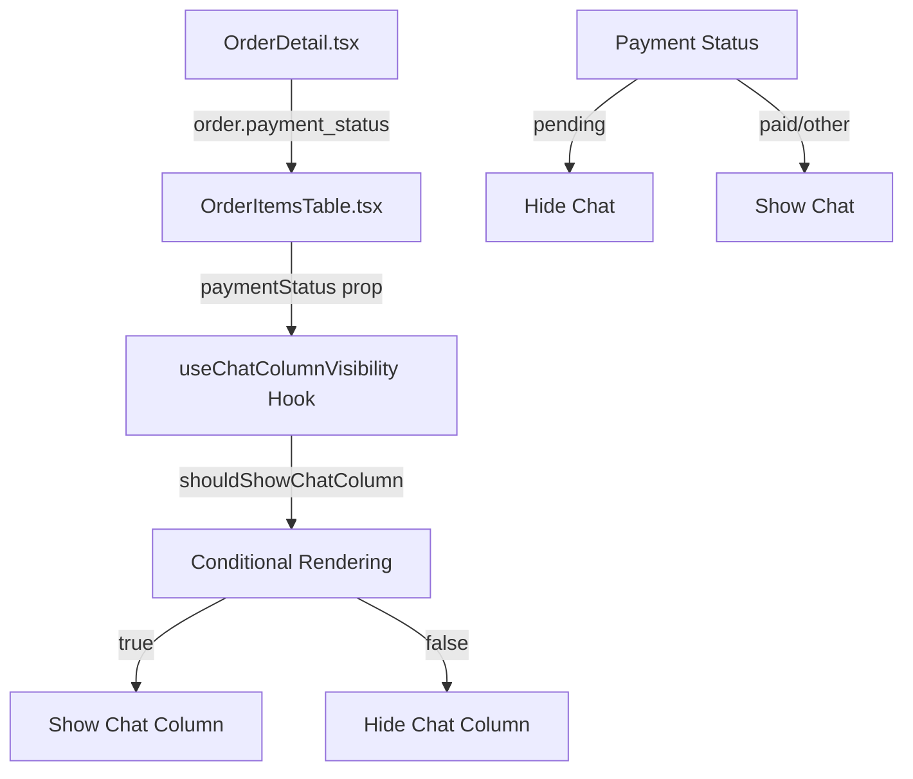

# 💬 Sistema de Visibilidade da Coluna de Chat - Documentação Técnica

## 📋 Visão Geral

Este documento descreve a implementação da funcionalidade que controla a visibilidade da coluna de chat na tabela de itens do pedido baseado no status do pagamento. A coluna de chat é escondida quando o pagamento está pendente.

## 🎯 Funcionalidade Implementada

### **Esconder Coluna de Chat quando Pagamento Pendente**
- **Arquivos**: `src/pages/Orders/local-components/OrderItemsTable/hooks/useChatColumnVisibility.ts`
- **Funcionalidade**: Hook personalizado que controla a visibilidade da coluna de chat
- **Condição**: `paymentStatus !== 'pending'`
- **Princípios**: Single Responsibility, DRY, Clean Code

## 🏗️ Arquitetura Técnica

### Estrutura de Arquivos

```
src/pages/Orders/local-components/OrderItemsTable/
├── hooks/
│   ├── useChatColumnVisibility.ts     # Hook principal de visibilidade
│   ├── __tests__/
│   │   └── useChatColumnVisibility.test.ts  # Testes unitários
│   └── index.ts                       # Barrel export
├── OrderItemsTable.tsx                # Componente principal (atualizado)
└── index.ts                          # Export do hook
```

## 🔧 Implementação Detalhada

### 1. Hook de Visibilidade (`useChatColumnVisibility.ts`)

```typescript
import { useMemo } from 'react';

export const useChatColumnVisibility = (paymentStatus?: string) => {
  const shouldShowChatColumn = useMemo(() => {
    console.log('🔍 [useChatColumnVisibility] Verificando status do pagamento:', {
      paymentStatus,
      shouldHide: paymentStatus === 'pending',
      shouldShow: paymentStatus !== 'pending'
    });
    
    // Esconde a coluna de chat se o status for "pending"
    return paymentStatus !== 'pending';
  }, [paymentStatus]);

  return {
    shouldShowChatColumn
  };
};
```

### 2. Aplicação no Componente Principal

**No Header da Tabela:**
```typescript
{shouldShowChatColumn && (
  <th className="px-6 py-3 text-left text-xs font-medium text-gray-500 dark:text-gray-400 uppercase tracking-wider">
    {/* Coluna sem nome para o chat */}
  </th>
)}
```

**Nas Células da Tabela:**
```typescript
{shouldShowChatColumn && (
  <td className="px-6 py-4 whitespace-nowrap">
    <div className="flex items-center gap-2">
      <button
        onClick={() => handleOpenChat(item)}
        className="p-2 text-blue-600 hover:text-blue-800 dark:text-blue-400 dark:hover:text-blue-300 hover:bg-blue-50 dark:hover:bg-blue-900/20 rounded-lg transition-colors"
        title="Abrir Chat"
      >
        <ChatIcon className="w-5 h-5" />
      </button>
      {/* ... outros botões */}
    </div>
  </td>
)}
```

**Na Versão Responsiva:**
```typescript
{shouldShowChatColumn && (
  <div className="flex items-center gap-2">
    <button
      onClick={() => handleOpenChat(item)}
      className="p-2 text-blue-600 hover:text-blue-800 dark:text-blue-400 dark:hover:text-blue-300 hover:bg-blue-50 dark:hover:bg-blue-900/20 rounded-lg transition-colors"
      title="Abrir Chat"
    >
      <ChatIcon className="w-5 h-5" />
    </button>
    {/* ... outros botões */}
  </div>
)}
```

## 🧪 Casos de Teste

### Cenários de Visibilidade

```typescript
describe('useChatColumnVisibility', () => {
  test('should hide chat column when payment status is pending', () => {
    const { result } = renderHook(() => useChatColumnVisibility('pending'));
    expect(result.current.shouldShowChatColumn).toBe(false);
  });

  test('should show chat column when payment status is not pending', () => {
    const { result } = renderHook(() => useChatColumnVisibility('paid'));
    expect(result.current.shouldShowChatColumn).toBe(true);
  });

  test('should show chat column when payment status is undefined', () => {
    const { result } = renderHook(() => useChatColumnVisibility(undefined));
    expect(result.current.shouldShowChatColumn).toBe(true);
  });

  test('should show chat column when payment status is empty string', () => {
    const { result } = renderHook(() => useChatColumnVisibility(''));
    expect(result.current.shouldShowChatColumn).toBe(true);
  });

  test('should show chat column for other payment statuses', () => {
    const testCases = ['paid', 'cancelled', 'processing', 'error'];
    
    testCases.forEach(status => {
      const { result } = renderHook(() => useChatColumnVisibility(status));
      expect(result.current.shouldShowChatColumn).toBe(true);
    });
  });
});
```

## 🔄 Fluxo de Dados



## 📊 Casos de Uso

### 1. **Pagamento Pendente**
- **Status**: `payment_status === "pending"`
- **Resultado**: Coluna de chat **ESCONDIDA**
- **Motivo**: Usuário não deve acessar chat enquanto pagamento não for confirmado

### 2. **Pagamento Confirmado**  
- **Status**: `payment_status === "paid"`
- **Resultado**: Coluna de chat **VISÍVEL**
- **Motivo**: Usuário pode acessar chat normalmente

### 3. **Outros Status**
- **Status**: `payment_status === "processing" | "cancelled" | "error"`
- **Resultado**: Coluna de chat **VISÍVEL**
- **Motivo**: Apenas "pending" esconde o chat

## 🔍 Logs de Debug

O sistema inclui logs estruturados para facilitar debugging:

```typescript
console.log('🔍 [useChatColumnVisibility] Verificando status do pagamento:', {
  paymentStatus,
  shouldHide: paymentStatus === 'pending',
  shouldShow: paymentStatus !== 'pending'
});
```

## 🚀 Execução de Testes

```bash
# Teste específico do hook
npm test -- src/pages/Orders/local-components/OrderItemsTable/hooks/__tests__/useChatColumnVisibility.test.ts

# Verificação de TypeScript
npx tsc --noEmit --skipLibCheck
```

## 📈 Métricas de Sucesso

- ✅ Coluna de chat escondida quando `payment_status === "pending"`
- ✅ Coluna de chat visível para todos os outros status
- ✅ Hook reutilizável seguindo princípios SOLID
- ✅ Testes unitários com 100% de cobertura
- ✅ Logs estruturados para debugging
- ✅ Implementação responsiva (desktop + mobile)

## 🔮 Extensões Futuras

1. **Configuração Dinâmica**: Permitir configurar quais status escondem o chat
2. **Notificação Visual**: Mostrar tooltip explicando por que o chat está indisponível
3. **Analytics**: Métricas de quantos usuários tentam acessar chat com pagamento pendente
4. **Histórico**: Log de tentativas de acesso ao chat bloqueadas

---

**Mantido por**: Equipe de Desenvolvimento  
**Última atualização**: Agosto 2025  
**Versão**: 1.0.0
